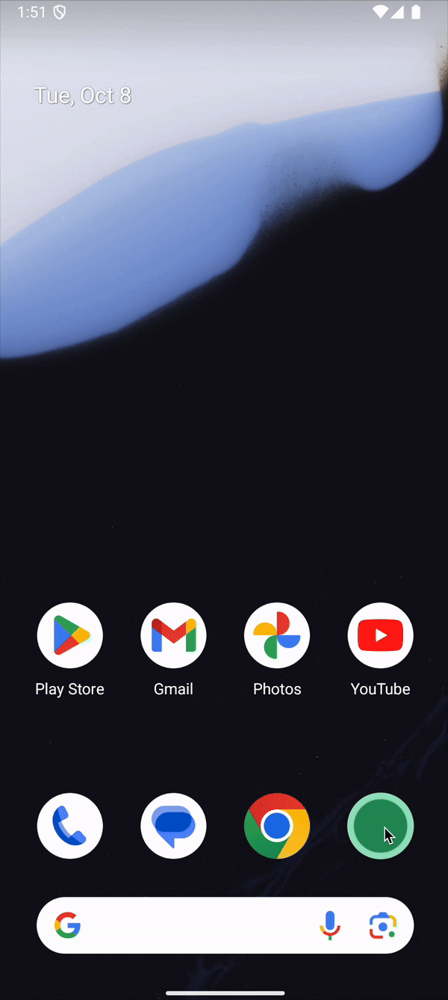

# 🎶 Basic Meditation Timer 🎶

**A very simple yet effective meditation timer:** This app goes beyond your stock phone timer by offering a tailored experience for meditators. Set your desired session length, and choose when you'd like a gentle audio cue to prompt you as your session nears its end—perfect for easing out of meditation. Once time’s up, a different sound signals the conclusion. With a clean, minimalistic interface, it's easy to configure both the session duration and the pre-ending reminder to suit your needs. Simple, functional, and designed to enhance your practice.

## 🤳 Demo 🤳

## 📈 Roadmap 📈

- Visual marker for reminder set in progress bar
- Add option to track time spent meditating in the background

